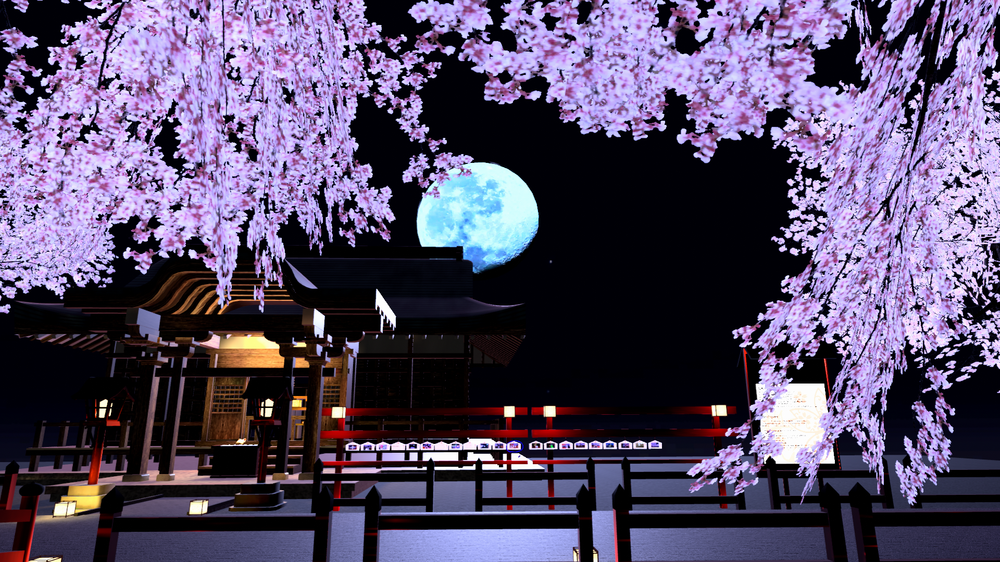
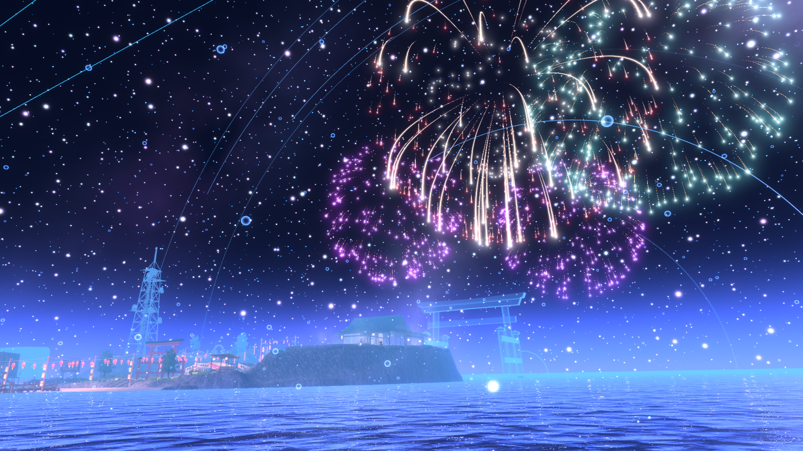
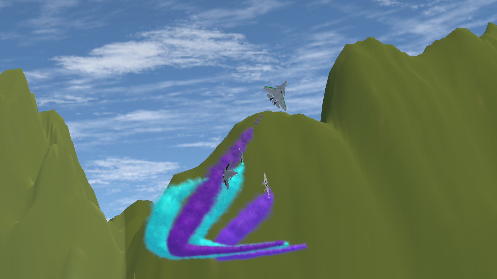

テックリード大塚です。  
私は主にVRの情報を発信していこうと思っています。  
  
第一回は「VRでなにができるの？」です。  
  
多くのことが再現、表現可能です。  
機器の準備をすることで視覚以外の感覚も再現することが可能になっています。  
企業だけでなくユーザーがワールド作成、イベント管理を行っているため日々体験の幅が拡大しています。  
まずはその一例を紹介できればと思います。  
  
# 【目次】  
①動画視聴  
②会議  
③企業・施設の体験・PR・ビジネス  
④景観・旅行・写真撮影  
⑤体験・ゲーム・エンターテイメント  
⑥コミュニケーション・飲み会・集会  
⑦個展・合同展示  
⑧医療  
⑨体感デバイス研究  
  
# 【結論】
目次の項目のような様々な事ができます。  
ビジネス目的としては以下があります。  
・VR会議  
・企業PR  
・施設PR  
・地域PR  
・コンテンツPR  
・新人などの研修  
・就職活動イベント  
・コンサルイベント  
・販売促進イベント  
・技術共有/交流イベント  
・ワールド/アバター/ブース生成代行  
・ワールド/アバター販売  
・ライブ  
・VTuber,Youtuber  
・VTuber管理  
・有料情報提供(PixivFanbox,独自サイト,Noteなど)  
・コミュニティ管理（PixivFanbox）  
・書籍販売  
  
# 【例：動画・静画・外部サイト】  
## ①動画視聴  
https://www.youtube.com/watch?v=znWybP38bqk  
https://www.gunkanjima-museum.jp/data/734/detail/  
  
## ②会議  
https://www.youtube.com/watch?v=jjsaUQUo8pw  
https://www.vrcjp.com/  
  
## ③企業・施設の体験・PR・ビジネス  
https://www.youtube.com/watch?v=bVrBt-5_UIY  
https://jrakiba.vketcloud.com/  
https://virtualokinawa.jp/  
https://www.gizmodo.jp/2022/05/metanavi-vrchat.html  
  
  
## ④景観・旅行・写真撮影  
https://twitter.com/kuraletto_JP/status/1494928799729070081  
   
   
  
## ⑤体験・ゲーム・エンターテイメント  
https://www.youtube.com/watch?v=yYwSuUrYzj0  
     
(フライトシミュレータギミックを使用した編隊飛行イベント)  
  
## ⑦個展・合同展示  
https://twitter.com/Virtual_Market_?ref_src=twsrc%5Egoogle%7Ctwcamp%5Eserp%7Ctwgr%5Eauthor  
  
## ⑨体感デバイス研究  
https://news.mynavi.jp/techplus/article/20220520-2348778/  
  
# 例：文章
①動画視聴  
　・自宅で超巨大スクリーンや疑似立体音響で動画を見ることができます。  
　　寝ながらでも上の空間にスクリーンを置くことで見ることができます。  
　・観光地や美術館などのコンテンツとしての利用が多いです。  
　　特に普段は入れない場所に立ちいったり、過去の状態を体験したりできます。  
  
## ②会議  
　・会議相手が実際にその場にいるかのように感じながら会議することができます。  
　　距離の制約を受けません。  
　　表情以外に身振り手振りなどで表現したり、図などを空間に配置するなどしてプレゼンに幅を持たせることなどができます。  
　・リアルに近いアバターを作成するサービス等も活用することでより現実感を持たせることもできます。  
　  
## ③企業・施設の体験・PR・ビジネス  
　・日産がワールド作成/イベントを行い電気自動車のPRを行いました。  
　・沖縄を再現/PRを行っている企業が存在します。  
　・現実にある施設のVR版をだして、観光PRしている施設が存在します。  
　・開発者向けの集会や就職活動用のイベントなども存在します。  
　・新人研修や導入などに活用されています。  
  
## ④景観・旅行・写真撮影  
　・現実に存在している場所を再現しているワールドが存在します。  
　・表現として素晴らしい景観のワールドを公開している人が存在しています。現実的なものや非現実的なものなど多数存在しています。  
　・実際に旅行のように体験できるサービスを提供しているコミュニティが存在します。  
　・VR内のワールドを写真撮影したり公開したりするコミュニティが存在します。  
  
## ⑤体験・ゲーム・エンターテイメント  
　・スポーツの体験ができます。  
　・飛行機/車などの操縦ができ、操縦するための教習を行っているコミュニティが存在します。  
　・VR用のゲーム体験ができます。実際にゲームの中に入ったような感覚で過ごせるものや、現実のゲームを再現したものなど様々な物があります。  
　・ラジオ体操/筋トレ/腰痛予防ストレッチ/ダンスなど体を動かすものがあります。  
　・ラジオ公開放送/お笑い/コンサート/演劇/カラオケ/DJイベント/ゲーム大会など様々なものが存在しています。  
　・VRならではのものとして、パーティクルという技術を使用したパーティクルライブというエンターテイメントがあります。  
  
## ⑥コミュニケーション・飲み会・集会  
　・ホームワールドや集会場をを活用してくつろいだり、一緒に動画を見たり、雑談したり、一緒にねたり。飲み会をおこなったりしている人がいます。  
　・BARという名目で店舗のようなイベントも存在します。  
　・「大阪に住んでいる人」とか「12月に始めた人」とか「初心者の人」とか「〇〇が好きな人」などテーマ別に集まって雑談・体験などを行うことができます。  
  
## ⑦個展・合同展示  
　・VRの企業活動/アバター3Dモデル販売などをPRして販売につなげる展示会が存在します。  
　・個人の画集などを見ることができるワールドが存在します。  
  
## ⑧医療  
　シミュレーションやカウンセリングで活用する事例があります。  
  
## ⑨体感デバイス研究  
　・呼吸の制御が研究されています。  
　・空気噴射によるスポーツ体感の向上試みが研究されています。  
　・超音波により触覚を体験するデバイスが開発されています。