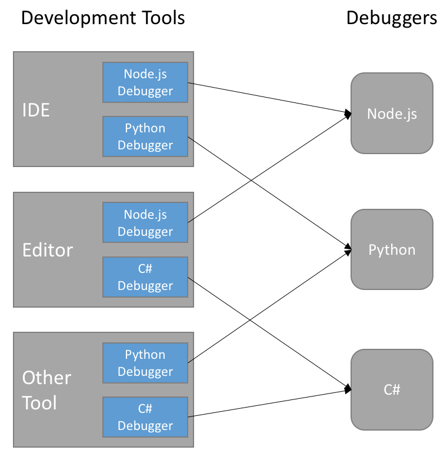
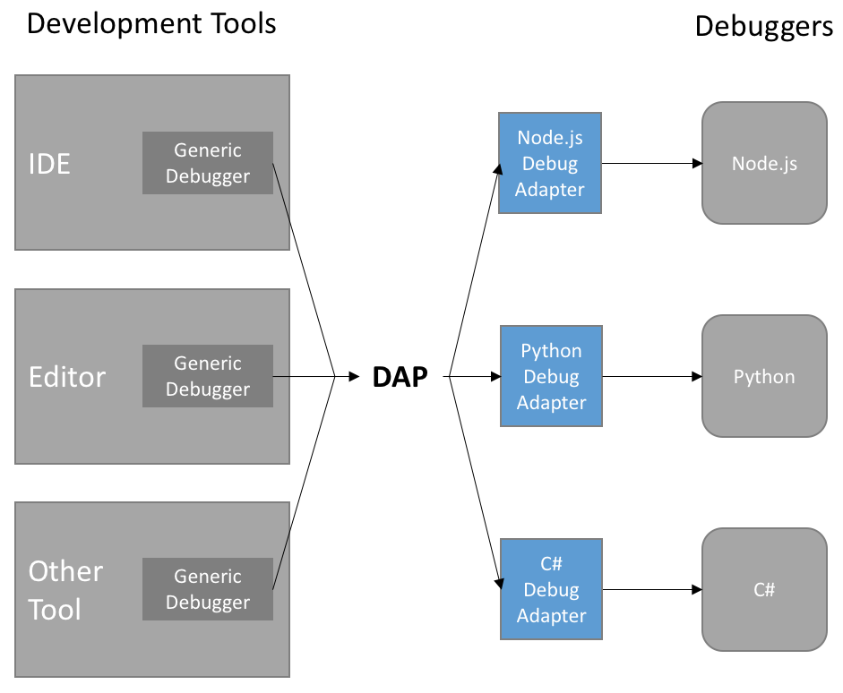
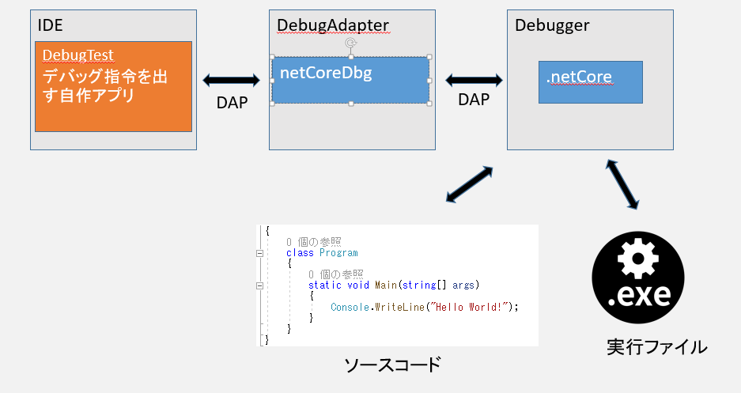
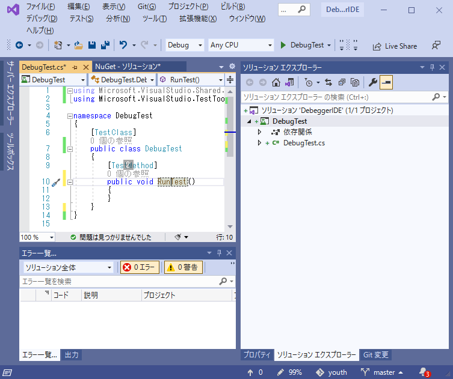
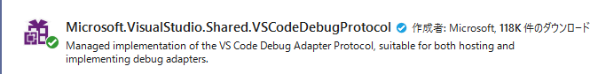
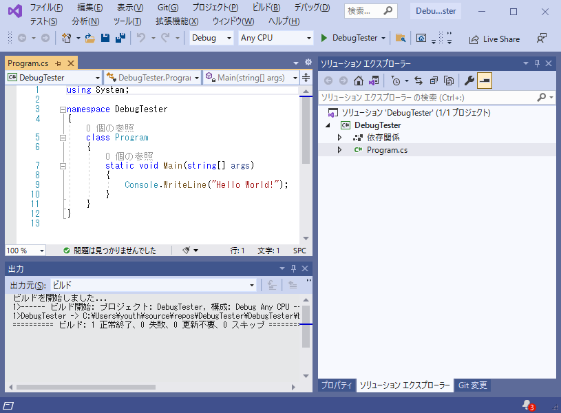

# ■修正  
2021/06/13  
調査の結果デバッガ再現のために変更したほうがよろしい点があったため修正。  
 6.DebugTestプロジェクトに最低限の動作コードを記述  
・RequestLunchのStopEntryをfalseに変更  
  
  
# ■初めに  
## ◇目的  
オープンソースを組み合わせて1_デバッガー操作してみよう！  
  
## ◇対象  
DAPによるC#1_デバッガー操作  
C#以外の執筆は現在未定。  
DAP自体は言語にあまり依存しないため、使用するデバッガを変えれば、少ない手間でPHP/Python/Javaなど別言語で動作します。  
  
## ◇環境  
VisualStudio2019   
.net5.0   
.netCore  
  
***  
# ■解説  
## ◇DAP  
### 〇DAPとは？  
Debug Adapter Protocol  
MicroSoftが公開している、デバッグ用のプロトコルです。  
  
### 〇何が便利なの？  
新しくデバッガIDE、エディタを作成するのは非常に手間がかかります。  
また、言語ごとに仕様が違うため、言語変われば使いまわすことができません。  
  
DAPでプロトコルを定義し共通化することで、言語が違っても共通フォーマットで1_デバッガーを操作できます。  
JSONをインプットしてJSONをアウトプットすることを実現しています。  
引用　https://microsoft.github.io/debug-adapter-protocol/overview  
#### 【従来のデバッガ】  
   
  
#### 【DAPを使用したデバッガ】  
   
  
### 〇基本要素  
#### ・リクエスト  
デバッガに機能をお願いする。  
例)実行/ステップ実行/ブレイクポイントを設定する/一時停止する  
  
#### ・レスポンス  
リクエスト結果の取得  
  
#### ・イベント  
デバッガからのイベント通知  
例)スレッド起動/停止/終了/切断  
  
## ◇netCoreDbg  
### 〇netCoreDbgとは？  
Samsungが公開している**C#1_デバッガー/デバッグアダプター**  
DAP、.net5.0に対応しています。  
.netCoreのみで.netFrameworkには対応していないため注意  
### 〇取得先  
GitHub  
  
## ◇VSCodeDebugProtocol  
### 〇VSCodeDebugProtocolとは？  
MicoroSoftがVisualStudioCodeで**DAPを使用するためのパッケージ**  
デバッグに指令を投げるためのJSonの作成、通知や、イベントの受信するためのクラスが用意されています。  
### 〇取得先  
Nuget  
  
***  
# ■環境構築  
## ◇構成  
    
  
## ◇手順  
  
### 1. VisualStudio2019を最新にする  
→.net5.0を使用するため  
  
### 2. netCodeDbgをダウンロードして任意に位置に配置  
#### 配布場所  
https://github.com/Samsung/netcoredbg/releases  
解凍して任意の位置に配置してください。  
  
### 3. テスト用プロジェクトを作成  
動作を試行錯誤しながらを目的としているのでTDD気味にテストプロジェクトを作成します。  
   
  
### 4. テスト用プロジェクトにVSCodeDebugProtocolを導入。  
Nugetパッケージから下記をテストプロジェクトに追加  
     
  
### 5.デバッグ対象のプロジェクトを作成  
.net5.0 .netCore コンソールでHelloWorldを作成  
   
  
### 6.DebugTestプロジェクトに最低限の動作コードを記述  
各動作の解説は次回  
ソースコード中の下記の位置を環境によって置き換えてください  
　process.StartInfo.FileName = @"■■各netcoredbg.exeのパスに置き換え■■";  
　　netcoredbg.exeのパス  
　request.Args.ConfigurationProperties.Add("program", @"■■各自デバッグ対象のパスに置き換え■■");  
　　TestDebugger.dllのパス  
```  
[TestClass]  
    public class DebugTest  
    {  
        [TestMethod]  
        public void RunTest()  
        {  
            using (var process = new Process())  
            {  
                try  
                {  
                    process.StartInfo.FileName = @"■■各netcoredbg.exeのパスに置き換え■■";  
                    process.StartInfo.Arguments = @" --interpreter=vscode";  
                    process.StartInfo.RedirectStandardInput = true;  
                    process.StartInfo.RedirectStandardOutput = true;  
                    process.Start();  
  
                    var debugAdapterHost = new DebugAdapterHost(process.StandardInput.BaseStream, process.StandardOutput.BaseStream);  
                    debugAdapterHost.Protocol.LogMessage += Protocol_LogMessage;  
                    debugAdapterHost.Protocol.Run();  
  
                    //初期化  
                    debugAdapterHost.RequestInitialize();  
                    debugAdapterHost.WaitForReader();  
  
                    //設定完了   
                    debugAdapterHost.RequstConfigurationDone();  
                    debugAdapterHost.WaitForReader();  
                          
                   //デバッグ動作開始  
                   debugAdapterHost.RequstLunch();  
                   debugAdapterHost.WaitForReader();  
                      
                   //実行中  
                   debugAdapterHost.RequstContinue();  
                   debugAdapterHost.WaitForReader();  
                      
                    //デバッグ終了  
                    debugAdapterHost.Protocol.Stop();  
                }  
                catch (ProtocolException e)  
                {  
                    Debug.WriteLine(e.Message);  
                }  
            }  
        }  
  
        private void Protocol_LogMessage(object sender, LogEventArgs e)  
        {  
            Trace.WriteLine(e.Message);  
        }  
    }  
  
  
    public class DebugAdapterHost : DebugAdapterHostBase  
    {  
        public int? ThreadId { get; private set; }  
  
        public DebugAdapterHost(Stream debugAdapterStdIn, Stream debugAdapterStdOut)  
        {  
            InitializeProtocolHost(debugAdapterStdIn, debugAdapterStdOut);  
        }  
  
        public void RequestInitialize()  
        {  
            var request = new InitializeRequest();  
            request.Args.ClientID = "vscode";  
            request.Args.ClientName = "Visual Studio Code";  
            request.Args.AdapterID = "coreclr";  
            request.Args.LinesStartAt1 = true;  
            request.Args.ColumnsStartAt1 = true;  
            request.Args.SupportsVariableType = true;  
            request.Args.SupportsVariablePaging = true;  
            request.Args.SupportsRunInTerminalRequest = true;  
            request.Args.Locale = "Jp-jp";  
            Protocol.SendRequestSync(request);  
        }  
  
        public void RequstLunch()  
        {  
            var request = new LaunchRequest();  
            request.Args.ConfigurationProperties.Add("name", ".NET Core Launch (console) with pipeline");  
            request.Args.ConfigurationProperties.Add("type", "coreclr");  
            request.Args.ConfigurationProperties.Add("preLaunchTask", "build");  
            request.Args.ConfigurationProperties.Add("program", @"■■各自デバッグ対象のパスに置き換え■■");// デバッグ対象のパス 注意:dllを指定すること  
            request.Args.ConfigurationProperties.Add("cwd", "");  
            request.Args.ConfigurationProperties.Add("console", "internalConsole");  
            request.Args.ConfigurationProperties.Add("stopAtEntry", false);  
            request.Args.ConfigurationProperties.Add("internalConsoleOptions", "openOnSessionStart");  
            request.Args.ConfigurationProperties.Add("__sessionId",Guid.NewGuid().ToString());  
            Protocol.SendRequestSync(request);  
        }  
  
        public void RequstConfigurationDone()  
        {  
            var request = new ConfigurationDoneRequest();  
            Protocol.SendRequestSync(request);  
        }  
  
        public void RequstContinue()  
        {  
            var request = new ContinueRequest();  
            if (!ThreadId.HasValue) return;  
            request.ThreadId = ThreadId.Value;  
            Protocol.SendRequestSync(request);  
        }  
  
        public void WaitForReader()  
        {  
            Protocol.WaitForReader(500);  
        }  
  
        protected override void HandleStoppedEvent(StoppedEvent body)   
        {  
            ThreadId = body.ThreadId;  
            base.HandleStoppedEvent(body);  
        }  
    }  
```  
  
### 7.デバッグ実行で動作確認  
出力タブに下記が出力されていれば成功。  
4.で作成したテスト用プロジェクトの出力内容である「Hello World!」が出力されていることが分かります。  
「<--   E (output): {"seq":17, "event":"output","type":"event","body":{"category":"stdout","output":"Hello World!\r\n"}}」  
  
---  
# ■次回以降について  
・最低限のコードの解説  
・デバッグを実現するうえでのシーケンスの公開  
・各リクエスト/レスポンス/イベントの解説  
・別言語でのデバッグについて  
  
記述するかは反応次第の予定。  
  