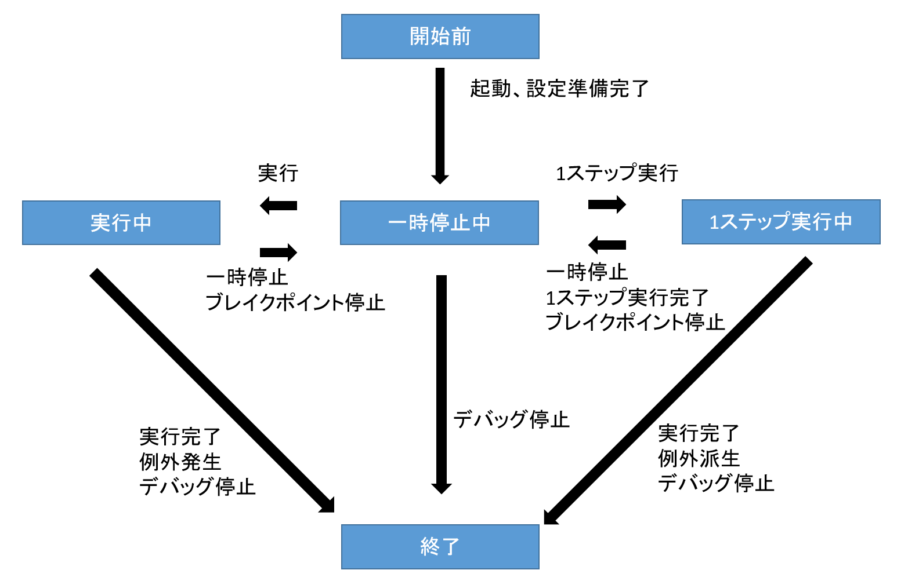
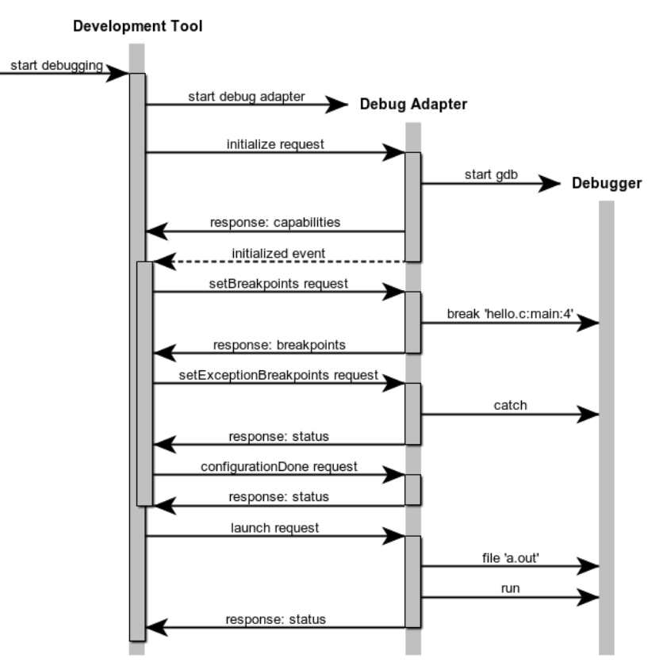
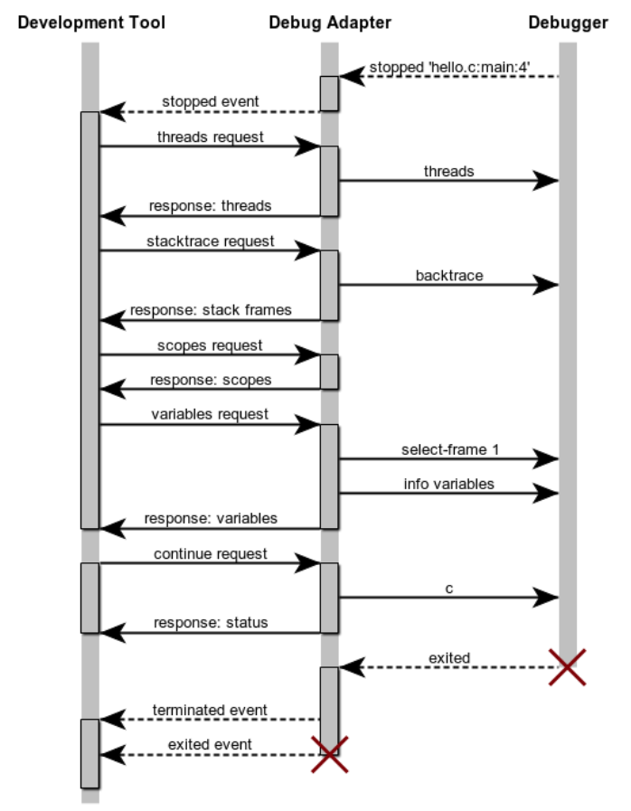

## ■今回の記事について  
Part1からの続き記事です。  
今回はデバッガー起動後の状態遷移、各動作のシーケンスを解説します。  
  
## ■状態遷移  
デバッガの状態は以下があります。  
・開始前  
・一時停止中  
・実行中  
・1ステップ実行中(ステップ、ステップイン、ステップオーバー、ステップバック)  
・終了  
  
  
  
## ■ブレイクポイント  
 
引用元：[DAP公式](https://microsoft.github.io/debug-adapter-protocol/overview)  
  
setBreakPointsリクエストを送りブレイクポイントを設定します。  
1ソース単位で送ります。  
この時有効になるすべてのブレイクポイントを送る必要があります。  
同一ソースで以前設定していたブレイクポイントはすべて消えます。  
  
このシーケンス図では実行前のみですが、実行中もsetBreakPointsリクエストを送りブレイクポイントを設定することができます。  
  
ブレイクポイントには種類があります。  
・ブレイクポイント  
　→ソースの行単位にせて設定  
・関数ブレイクポイント  
　→関数実行時に設定  
・例外ブレイクポイント  
　→例外発生時に設定  
  
デバッガによって対応状況が異なり使用できないことがあります。  
  
## ■実行コマンド  
各実行コマンドは以下の通りです。  
・Continueリクエスト  
　→実行  
・Nextリクエスト  
　→ステップ  
・StepInリクエスト  
　→ステップイン  
・StepOutリクエスト  
　→ステップオーバー  
・StepBackリクエスト  
　→ステップバック  
  
デバッガによって対応状況が異なり使用できないことがあります。  
netCoreDbgではステップバックはできません。  
  
## ■停止後の動作  
 
引用元：[DAP公式](https://microsoft.github.io/debug-adapter-protocol/overview)  
  
停止するときStoppedイベントが発生します。  
何が要因で停止したかは引数を見ればわかります。  
例）  
　開始時（Entry）  
　ブレイクポイント  
　例外  
  
停止後行う動作として以下があります。  
・稼働スレッド一覧の取得  
・スタックトレースの取得  
・スコープの取得  
・変数の取得  
・ウォッチの取得  
  
## ■実行後  
 
引用元：[DAP公式](https://microsoft.github.io/debug-adapter-protocol/overview)  
  
以下のイベントが発生します  
・terminateイベント  
・exitedイベント  
  
## ■次回以降について  
今回紹介した動作を実行するためのソースコードを紹介します。  
  
