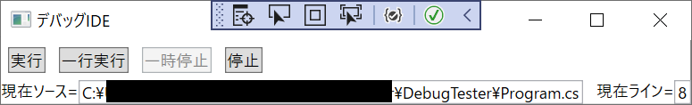

## ■今回の記事について  
Part1からの続き記事です。  
今回は実行・一行実行・一時停止・停止・終了の各操作の実例を解説します。  
  
## ■前提  
  
Part2で解説した初期化の部分は特に触れません。  
  
## ■実行  
  
〇初回起動  
　LaunchRequestの引数「stopAtEntry」をfalseにして実行します。  
  
〇2回目以降の起動  
　ContinueRequestをデバッガに送ることで実行開始できます。  
　引数にThreadIdを指定して、開始するスレッドを選択することが可能です。  
  
〇対応コード  
```  
private void RequestContinue()  
{  
    var request = new ContinueRequest();  
    if (!ThreadId.HasValue) return;  
    request.ThreadId = ThreadId.Value;  
    Protocol.SendRequestSync(request);  
}  
```  
  
## ■一行実行  
  
〇初回起動  
  
　LaunchRequestの引数「stopAtEntry」をtrueにして実行します。  
  
〇2回目以降の起動  
  
NextRequestをデバッガに送ることで実行開始できます。  
引数にThreadIdを指定して、開始するスレッドを選択することが可能です。  
StepInしたいときはStepInRequestを送ります。  
StepOutしたいときはStepOutRequestを送ります。  
戻したいときはStepBackRequestを送ります。  
デバッガによっては対応していない場合があります。  
netCoreDbgはStepBackには対応していません。  
  
〇対応コード  
```  
private void RequestStep()  
{  
    var request = new NextRequest();  
    if (!ThreadId.HasValue) return;  
    request.ThreadId = ThreadId.Value;  
    Protocol.SendRequestSync(request);  
}  
```  
  
## ■停止による更新  
  
DebugAdapterHostBaseよりHandleStoppedEventを継承して実装します。  
  
停止時HandleStoppedEventが実行されます。  
  
引数Reasonにより止まった理由を確認できます。  
  
〇理由抜粋  
・Entry(初回停止)  
・Breakpoint（通常ブレイクポイントによる停止）  
・Step（ステップ実行による停止）  
・Exception（例外発生による停止）  
  
〇注意点  
・別スレッドから発生します。  
　UI更新に注意  
  
・StackTraceRequestでスタックトレースが取れますが同一スレッドは実行できません。  
　スレッドを別に立ち上げてリクエストを送ります。  
  
〇対応コード  
```  
protected override void HandleStoppedEvent(StoppedEvent body)  
{  
    //別スレッドから来るので注意  
    //帰って来たスレッドだとリクエストを発信できないので別スレッド立ち上げる  
    Task.Run(() =>  
    {  
        lock (_lock)  
        {  
            ThreadId = body.ThreadId;  
            _status = Status.Pause;  
            switch (body.Reason)  
            {  
                case StoppedEvent.ReasonValue.Pause:  
                case StoppedEvent.ReasonValue.Step:  
                case StoppedEvent.ReasonValue.Breakpoint:  
                case StoppedEvent.ReasonValue.Entry:  
                    var stackFrames = RequestStackTrace();  
                    _stoppedSubject.OnNext(stackFrames.Last());  
                    break;  
                case StoppedEvent.ReasonValue.Exception:  
                        //例外発生  
                        break;  
                case StoppedEvent.ReasonValue.Goto:  
                case StoppedEvent.ReasonValue.FunctionBreakpoint:  
                case StoppedEvent.ReasonValue.DataBreakpoint:  
                case StoppedEvent.ReasonValue.InstructionBreakpoint:  
                case StoppedEvent.ReasonValue.Restart:  
                case StoppedEvent.ReasonValue.Unknown:  
                    throw new NotSupportedException();  
            }  
            base.HandleStoppedEvent(body);  
        }  
    });  
}  
```  
  
## ■終了  
  
DebugAdapterHostBaseよりHandleExitedEventを継承して実装します。  
  
終了時にHandleExitedEventが実行されます。  
  
下記を実行することでデバッガーを停止できます。  
  
 ```  
Protocol.Stop();  
```  
  
〇注意点  
・別スレッドから発生します。  
　UI更新に注意  
  
〇対応コード  
```  
//DebugAdoterHost  
protected override void HandleExitedEvent(ExitedEvent body)  
{  
    lock (_lock)  
    {  
        //別スレッドから来るので注意  
        //帰って来たスレッドだとリクエストを発信できないので別スレッド立ち上げる  
        Task.Run(() =>  
        {  
            _status = Status.Standby;  
            base.HandleExitedEvent(body);  
            _extedSubject.OnNext(1);  
        });  
    }  
}  
  
public void Dispose()  
{  
    if (Protocol.IsRunning)  
    {  
        Protocol.Stop();  
    }  
    _process.Kill();  
    _process.Dispose();  
}  
  
//DebugggerIDEViewModel  
private void RemoveDebug()  
{  
    SoucePath.Value = string.Empty;  
    Line.Value = 0;  
    if (_debugAdapterHost == null)  
    {  
        return;  
    }  
    _debugAdapterHost.Protocol.LogMessage -= Protocol_LogMessage;  
    _debugAdapterHost.Dispose();  
    _debugAdapterHost = null;  
    _compositeDisposableDebug.Dispose();  
    _compositeDisposableDebug = null;  
}  
  
```  
  
## ■停止  
  
終了時と同様の処理を行い停止させます。  
   
## ■サンプルソース  
  
WPF + .net5.0 + ReactiveExtention　で実装  
  
〇デバッガ本体  
```  
using Microsoft.VisualStudio.Shared.VSCodeDebugProtocol;  
using Microsoft.VisualStudio.Shared.VSCodeDebugProtocol.Messages;  
using System;  
using System.Collections.Generic;  
using System.Diagnostics;  
using System.Linq;  
using System.Reactive.Subjects;  
using System.Threading.Tasks;  
  
namespace Debuger  
{  
    public class DebugAdapterHost : DebugAdapterHostBase, IDisposable  
    {  
        private enum Status  
        {  
            Standby,  
            Run,  
            Pause,  
        }  
  
        public bool CanRun => _status is Status.Standby or Status.Pause;  
        public bool CanStep => _status is Status.Standby or Status.Pause;  
        public bool CanStop => _status is Status.Run or Status.Pause;  
        public int? ThreadId { get; private set; }  
  
        private Status _status = Status.Standby;  
        private string _programPath;  
        private Process _process;  
        private object _lock = new object();  
        private Subject<Microsoft.VisualStudio.Shared.VSCodeDebugProtocol.Messages.StackFrame> _stoppedSubject = new Subject<Microsoft.VisualStudio.Shared.VSCodeDebugProtocol.Messages.StackFrame>();  
        private Subject<object> _extedSubject = new Subject<object>();  
  
        public IObservable<Microsoft.VisualStudio.Shared.VSCodeDebugProtocol.Messages.StackFrame> Stopped => _stoppedSubject;  
        public IObservable<object> Exited => _extedSubject;  
  
        public DebugAdapterHost(string netCoreDbgPath, string programPath)  
        {  
            _programPath = programPath;  
  
            _process = new Process();  
            _process.StartInfo.FileName = netCoreDbgPath;  
            _process.StartInfo.Arguments = @" --interpreter=vscode";  
            _process.StartInfo.RedirectStandardInput = true;  
            _process.StartInfo.RedirectStandardOutput = true;  
            _process.StartInfo.CreateNoWindow = true;  
            _process.Start();  
  
            InitializeProtocolHost(_process.StandardInput.BaseStream, _process.StandardOutput.BaseStream);  
  
            Protocol.Run();  
        }  
  
        public void Run()  
        {  
            lock (_lock)  
            {  
                if (_status == Status.Run)  
                {  
                    return;  
                }  
  
                if (_status == Status.Standby)  
                {  
                    Initialize(false);  
                    return;  
                }  
                _status = Status.Run;  
                RequestContinue();  
            }  
        }  
        public void Step()  
        {  
            lock (_lock)  
            {  
                if (_status == Status.Run)  
                {  
                    return;  
                }  
  
                if (_status == Status.Standby)  
                {  
                    Initialize(true);  
                    return;  
                }  
                _status = Status.Run;  
                RequestStep();  
            }  
        }  
  
        public void Stop()  
        {  
            lock (_lock)  
            {  
                _status = Status.Standby;  
                Protocol.Stop();  
                _extedSubject.OnNext(1);  
            }  
        }  
  
        public void WaitForReader()  
        {  
            Protocol.WaitForReader(500);  
        }  
  
        public void Dispose()  
        {  
            if (Protocol.IsRunning)  
            {  
                Protocol.Stop();  
            }  
            _process.Kill();  
            _process.Dispose();  
        }  
  
        protected override void HandleStoppedEvent(StoppedEvent body)  
        {  
            //別スレッドから来るので注意  
            //帰って来たスレッドだとリクエストを発信できないので別スレッド立ち上げる  
            Task.Run(() =>  
            {  
                lock (_lock)  
                {  
                    ThreadId = body.ThreadId;  
                    _status = Status.Pause;  
                    switch (body.Reason)  
                    {  
                        case StoppedEvent.ReasonValue.Pause:  
                        case StoppedEvent.ReasonValue.Step:  
                        case StoppedEvent.ReasonValue.Breakpoint:  
                        case StoppedEvent.ReasonValue.Entry:  
                            var stackFrames = RequestStackTrace();  
                            _stoppedSubject.OnNext(stackFrames.Last());  
                            break;  
                        case StoppedEvent.ReasonValue.Exception:  
                                //例外発生  
                                break;  
                        case StoppedEvent.ReasonValue.Goto:  
                        case StoppedEvent.ReasonValue.FunctionBreakpoint:  
                        case StoppedEvent.ReasonValue.DataBreakpoint:  
                        case StoppedEvent.ReasonValue.InstructionBreakpoint:  
                        case StoppedEvent.ReasonValue.Restart:  
                        case StoppedEvent.ReasonValue.Unknown:  
                            throw new NotSupportedException();  
                    }  
                    base.HandleStoppedEvent(body);  
                }  
            });  
        }  
  
        protected override void HandleExitedEvent(ExitedEvent body)  
        {  
            lock (_lock)  
            {  
                //別スレッドから来るので注意  
                //帰って来たスレッドだとリクエストを発信できないので別スレッド立ち上げる  
                Task.Run(() =>  
                {  
                    _status = Status.Standby;  
                    base.HandleExitedEvent(body);  
                    _extedSubject.OnNext(1);  
                });  
            }  
        }  
  
        private void RequestInitialize()  
        {  
            var request = new InitializeRequest();  
            request.Args.ClientID = "vscode";  
            request.Args.ClientName = "Visual Studio Code";  
            request.Args.AdapterID = "coreclr";  
            request.Args.LinesStartAt1 = true;  
            request.Args.ColumnsStartAt1 = true;  
            request.Args.SupportsVariableType = true;  
            request.Args.SupportsVariablePaging = true;  
            request.Args.SupportsRunInTerminalRequest = true;  
            request.Args.Locale = "Jp-jp";  
            Protocol.SendRequestSync(request);  
        }  
  
        private void RequestLunch(bool stopEntry)  
        {  
            var request = new LaunchRequest();  
            request.Args.ConfigurationProperties.Add("name", ".NET Core Launch (console) with pipeline");  
            request.Args.ConfigurationProperties.Add("type", "coreclr");  
            request.Args.ConfigurationProperties.Add("preLaunchTask", "build");  
            request.Args.ConfigurationProperties.Add("program", _programPath);// デバッグ対象のパス  
            request.Args.ConfigurationProperties.Add("cwd", "");  
            request.Args.ConfigurationProperties.Add("console", "internalConsole");  
            request.Args.ConfigurationProperties.Add("stopAtEntry", stopEntry);  
            request.Args.ConfigurationProperties.Add("internalConsoleOptions", "openOnSessionStart");  
            request.Args.ConfigurationProperties.Add("__sessionId", Guid.NewGuid().ToString());  
            Protocol.SendRequestSync(request);  
        }  
  
        private void RequstConfigurationDone()  
        {  
            var request = new ConfigurationDoneRequest();  
            Protocol.SendRequestSync(request);  
        }  
  
        private void RequestContinue()  
        {  
            var request = new ContinueRequest();  
            if (!ThreadId.HasValue) return;  
            request.ThreadId = ThreadId.Value;  
            Protocol.SendRequestSync(request);  
        }  
  
        private void RequestStep()  
        {  
            var request = new NextRequest();  
            if (!ThreadId.HasValue) return;  
            request.ThreadId = ThreadId.Value;  
            Protocol.SendRequestSync(request);  
        }  
  
 
        private List<Microsoft.VisualStudio.Shared.VSCodeDebugProtocol.Messages.StackFrame> RequestStackTrace()  
        {  
            if (ThreadId == null)  
            {  
                return new List<Microsoft.VisualStudio.Shared.VSCodeDebugProtocol.Messages.StackFrame>();  
            }  
            var request = new StackTraceRequest();  
            request.ThreadId = ThreadId.Value;  
            var responce = Protocol.SendRequestSync(request);  
            return responce.StackFrames;  
        }  
  
        private void Initialize(bool stopEntry)  
        {  
            RequestInitialize();  
            RequestLunch(stopEntry);  
            RequstConfigurationDone();  
            _status = Status.Run;  
        }  
    }  
}  
  
```  
  
〇ビュー・ビューモデル  
```  
using Microsoft.VisualStudio.Shared.VSCodeDebugProtocol;  
using Reactive.Bindings;  
using Reactive.Bindings.Extensions;  
using System;  
using System.ComponentModel;  
using System.Diagnostics;  
using System.Reactive.Disposables;  
using System.Reactive.Linq;  
using System.Windows;  
using System.Windows.Threading;  
  
namespace Debuger  
{  
    public partial class DebuggerIDE : Window  
    {  
        private DebugggerIDEViewModel _viewModel;  
  
        public DebuggerIDE()  
        {  
            InitializeComponent();  
            _viewModel = new DebugggerIDEViewModel(this, "[★netCoreDbgのパス]","[★デバッグ対象のパス] );  
            DataContext = _viewModel;  
        }  
  
        private void Window_Closed(object sender, EventArgs e)  
        {  
            _viewModel.Dispose();  
        }  
    }  
  
    public class DebugggerIDEViewModel : INotifyPropertyChanged, IDisposable  
    {  
        public ReactiveCommand<object> RunCommand { get; } = new ReactiveCommand<object>();  
        public ReactiveCommand<object> StepCommand { get; } = new ReactiveCommand<object>();  

        public ReactiveCommand<object> StopCommand { get; } = new ReactiveCommand<object>();  
  
        public ReactiveProperty<bool> IsEnabledRun { get; } = new ReactiveProperty<bool>();  
        public ReactiveProperty<bool> IsEnabledStep { get; } = new ReactiveProperty<bool>();  
        public ReactiveProperty<bool> IsEnabledStop { get; } = new ReactiveProperty<bool>();  
        public ReactiveProperty<string> SoucePath { get; } = new ReactiveProperty<string>();  
        public ReactiveProperty<int> Line { get; } = new ReactiveProperty<int>();  
  
        private Dispatcher _dispacher;  
        private string _netCoreDbgPath;  
        private string _programPath;  
        private DebugAdapterHost _debugAdapterHost;  
  
        private CompositeDisposable _compositeDisposableUI = new CompositeDisposable();  
        private CompositeDisposable _compositeDisposableDebug;  
  
        public event PropertyChangedEventHandler PropertyChanged;  
  
        public DebugggerIDEViewModel(UIElement parent, string netCoreDbgPath, string programPath)  
        {  
            RunCommand.Subscribe(_ => Run()).AddTo(_compositeDisposableUI);  
            StepCommand.Subscribe(_ => Step()).AddTo(_compositeDisposableUI);  
            StopCommand.Subscribe(_ => Stop()).AddTo(_compositeDisposableUI);  
            _dispacher = parent.Dispatcher;  
            _netCoreDbgPath = netCoreDbgPath;  
            _programPath = programPath;  
            InitializeDebugAdapterHost();  
            UpdateEnabled();  
        }  
  
        private void InitializeDebugAdapterHost()  
        {  
            if (_compositeDisposableDebug != null)  
            {  
                _compositeDisposableDebug.Dispose();  
                _compositeDisposableDebug = null;  
            }  
            _compositeDisposableDebug = new CompositeDisposable();  
            _debugAdapterHost = new DebugAdapterHost(_netCoreDbgPath, _programPath);  
            _debugAdapterHost.Protocol.LogMessage += Protocol_LogMessage;  
            _debugAdapterHost.Stopped.Subscribe(Stopped).AddTo(_compositeDisposableDebug);  
            _debugAdapterHost.Exited.Subscribe(Exited).AddTo(_compositeDisposableDebug);  
        }  
  
        public void Dispose()  
        {  
            RemoveDebug();  
            _compositeDisposableUI.Dispose();  
        }  
  
        private void RemoveDebug()  
        {  
            SoucePath.Value = string.Empty;  
            Line.Value = 0;  
            if (_debugAdapterHost == null)  
            {  
                return;  
            }  
            _debugAdapterHost.Protocol.LogMessage -= Protocol_LogMessage;  
            _debugAdapterHost.Dispose();  
            _debugAdapterHost = null;  
            _compositeDisposableDebug.Dispose();  
            _compositeDisposableDebug = null;  
        }  
  
        private void Run()  
        {  
            if(_debugAdapterHost == null)  
            {  
                InitializeDebugAdapterHost();  
            }  
            _debugAdapterHost.Run();  
            UpdateEnabled();  
        }  
  
        private void Step()  
        {  
            if (_debugAdapterHost == null)  
            {  
                InitializeDebugAdapterHost();  
            }  
            _debugAdapterHost.Step();  
            UpdateEnabled();  
        }  

        private void Stop()  
        {  
            RemoveDebug();  
            UpdateEnabled();  
        }  
  
        private void UpdateEnabled()  
        {  
            if(_debugAdapterHost == null)  
            {  
                IsEnabledRun.Value = true;  
                IsEnabledStep.Value = true;  
                IsEnabledStop.Value = false;  
                return;  
            }  
            IsEnabledRun.Value = _debugAdapterHost.CanRun;  
            IsEnabledStep.Value = _debugAdapterHost.CanStep;  
            IsEnabledStop.Value = _debugAdapterHost.CanStop;  
        }  
  
        private void Stopped(Microsoft.VisualStudio.Shared.VSCodeDebugProtocol.Messages.StackFrame stackFrame)  
        {  
            //別スレッドから帰ってくるので注意  
            _dispacher.BeginInvoke(() =>  
            {  
                SoucePath.Value = stackFrame.Source.Path;  
                Line.Value = stackFrame.Line;  
                UpdateEnabled();  
            });  
        }  
  
        private void Exited(object obj)  
        {  
            //別スレッドから帰ってくるので注意  
            _dispacher.BeginInvoke(() =>  
            {  
                UpdateEnabled();  
                RemoveDebug();  
            });  
        }  
  
        private void Protocol_LogMessage(object sender, LogEventArgs e)  
        {  
            Trace.WriteLine(e.Message);  
        }  
    }  
  
}  
```  
  
〇xaml  
```  
<Window x:Class="Debuger.DebuggerIDE"  
        xmlns="http://schemas.microsoft.com/winfx/2006/xaml/presentation"  
        xmlns:x="http://schemas.microsoft.com/winfx/2006/xaml"  
        xmlns:d="http://schemas.microsoft.com/expression/blend/2008"  
        xmlns:mc="http://schemas.openxmlformats.org/markup-compatibility/2006"  
        xmlns:local="clr-namespace:Debuger"  
        d:DataContext="{d:DesignInstance local:DebugggerIDEViewModel}"  
        mc:Ignorable="d"  
        Title="デバッグIDE" Height="100" Width="300" SizeToContent="WidthAndHeight"  
        Closed="Window_Closed">  
    <Grid>  
        <Grid.RowDefinitions>  
            <RowDefinition Height="Auto"/>  
            <RowDefinition Height="Auto"/>  
        </Grid.RowDefinitions>  
        <StackPanel Grid.Row="0" Orientation="Horizontal">  
            <Button Content="実行" Command="{Binding RunCommand}" IsEnabled="{Binding IsEnabledRun.Value}" Margin="5"/>  
            <Button Content="一行実行" Command="{Binding StepCommand}" IsEnabled="{Binding IsEnabledStep.Value}" Margin="5"/>  
            <Button Content="停止" Command="{Binding StopCommand}" IsEnabled="{Binding IsEnabledStop.Value}" Margin="5"/>  
        </StackPanel>  
        <StackPanel Grid.Row="1" Orientation="Horizontal">  
            <TextBlock Text="現在ソース="/>  
            <TextBox Text="{Binding SoucePath.Value}" Margin="0,0,10,0" IsReadOnly="True"/>  
            <TextBlock Text="現在ライン="/>  
            <TextBox Text="{Binding Line.Value}" IsReadOnly="True"/>  
        </StackPanel>  
    </Grid>  
</Window>  
  
```  
  
重要な箇所以外は端折っています。  
  
個別に解説が欲しい等があれば解説します。  
  
〇実行イメージ  
    
  
## ■次回について  
  
例外の出力の仕方・変数一覧の取得方法・ウォッチの取得を解説します。  
