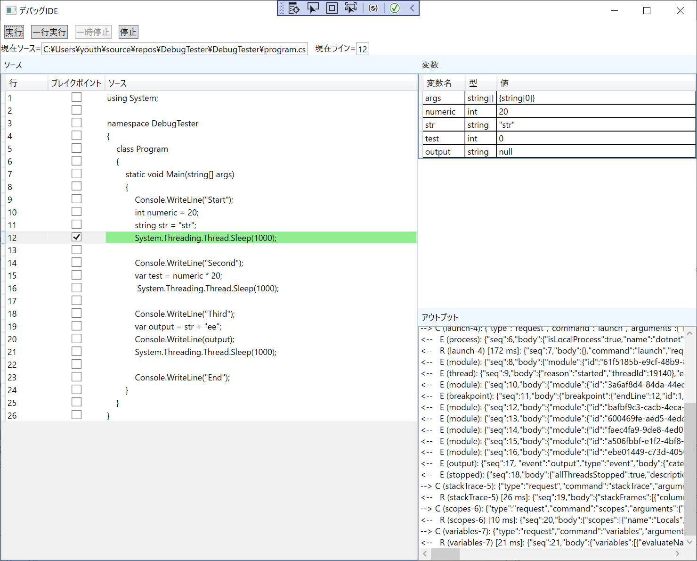

## ■今回の記事ついて  
Part1からの続き記事です。  
ブレイクポイント・変数一覧・現在行表示を解説します。  
今回で一気にIDEのような見た目になります。  
  
## ■完成イメージ  
     
  
## ■ブレイクポイント  
〇必要な対応  
　SetBreakpointsRequestを送る  
〇必要な情報  
　・ソースコードのパス  
　・ブレイクポイント設定する行番号  
〇注意点  
　・そのソースコード内のブレイクポイントを一気に設定する必要があります。  
　　部分的に追加削除するのではなくすべて再設定します。  
　・設定できない箇所にブレイクポイントを設定すると、直近の有効な場所にブレイクポイントが移動します。  
　・ビルド実行前はInitializeRequestを送った後、ConfigurationDoneを送るまでの間に設定することができます。  
　・ビルド実行中も送ることができます。  
〇コード  
```  
public void UpdateBreakPoint()  
{  
    var request = new SetBreakpointsRequest();  
    var source =  new Source();  
    source.Name = Path.GetFileName(_sourcePath);  
    source.Path = _sourcePath;  
    request.Source = source;  
    foreach (var line in _breakPointLines)  
    {  
        request.Breakpoints.Add(new SourceBreakpoint(line));  
    }  
    Protocol.SendRequestSync(request);  
}  
```  
## ■変数一覧  
　〇必要な対応  
　　１．StatckTraceRequsetでスタックトレースを取得する。  
　　２．ScopesRequestでスコープを取得する  
　　３．VariablesRequestで現在存在する変数一覧を取得する。  
　〇必要な情報  
　　・ThreadId(StoppedEventから取得)  
　　・FrameId(StackFrameから取得)  
　　・VariableReference(Scopeから取得)  
　〇取得できるもの  
　　変数名  
　　型名  
　　値  
　　VariablesReference（変数の識別子、メンバ変数など、さらに下の階層を読み取るのに使用）  
　〇注意点  
　　・今回対応しているのはプリミティブな型のみです。  
　　　クラス・配列・リストなどは取得してきたVariableRefarenceを使用してさらにVariablesRequestを発信することで取得できます。  
　　　ここで注意したいのは無限ループです。  
　　　List、Exception、Enum等は自己参照を保持しているので階層を潜るコードを単純に実装すると無限ループに陥ります。  
　　・階層の深いクラスを読むと通信が複数回発生するので遅くなります。  
　　　高級な対応をするのであれば対策が必要です。  
　　・リクエストを送るためには別スレッドで送る必要があります。  
　　・停止の仕方がかなり種類があるので場合によってはしっかり理解する必要があります。  
　　・今回は単純にするためスタックフレームを最新にスコープをローカルのみにしています。  
　　・static変数はうまく取れません。  
　　　ウォッチ機能（未解説）で取得できます。  
　　　この問題は癖が強いためまだまだ問題を抱えている可能性があります。  
　　・デバッグ対象がTaskを使用する場合、スタックトレースの最後位置がTask内ではなくTask外になるため注意が必要です。  
　　　最後のスタックフレームではなく1階層前のスタックフレームにしないと取得できません。  
　　・jsonの値をそのまま表示しています。  
 　　  パスや文字列をそのままの値にしたい場合はJsonのアンエスケープが必要です。  
　〇ソースコード  
```  
protected override void HandleStoppedEvent(StoppedEvent body)  
{  
    //別スレッドから来るので注意  
    //帰って来たスレッドだとリクエストを発信できないので別スレッド立ち上げる  
    Task.Run(() =>  
    {  
        lock (_lock)  
        {  
            ThreadId = body.ThreadId;  
            _status = Status.Pause;  
            switch (body.Reason)  
            {  
                case StoppedEvent.ReasonValue.Pause:  
                case StoppedEvent.ReasonValue.Step:  
                case StoppedEvent.ReasonValue.Breakpoint:  
                case StoppedEvent.ReasonValue.Entry:  
                    OnNextStopped();  
                    break;  
                case StoppedEvent.ReasonValue.Exception:  
                    //例外発生  
                    break;  
                case StoppedEvent.ReasonValue.Goto:  
                case StoppedEvent.ReasonValue.FunctionBreakpoint:  
                case StoppedEvent.ReasonValue.DataBreakpoint:  
                case StoppedEvent.ReasonValue.InstructionBreakpoint:  
                case StoppedEvent.ReasonValue.Restart:  
                case StoppedEvent.ReasonValue.Unknown:  
                    throw new NotSupportedException();  
            }  
            base.HandleStoppedEvent(body);  
        }  
    });  
}  
  
private void OnNextStopped()  
{  
    var stackFrames = RequestStackTrace();  
    var scopeRequest = new ScopesRequest();  
    var stakFrame = stackFrames.First();  
    scopeRequest.FrameId = stakFrame.Id;  
    var scopeResponse = Protocol.SendRequestSync(scopeRequest);  
  
    var request = new VariablesRequest();  
    request.VariablesReference = scopeResponse.Scopes.First().VariablesReference;  
    var response = Protocol.SendRequestSync(request);  
  
    var variableItemList = new List<VariableItem>();  
    foreach (var variable in response.Variables)  
    {  
        variableItemList.Add(new VariableItem(variable.Name, variable.Type, variable.Value));  
    }  
    _stoppedSubject.OnNext(new StopArugument(stakFrame, variableItemList));  
}  
```  
## ■プロジェクト公開  
DebeggerIDEソース参照
　  
〇注意点  
　・netCoreDbgが日本語コードに対応していないため、パスに日本語が混じると動作しないです。  
　・パスはダミー文字に変えています。TODOをいれているので修正して使ってください。  
  
## ■残件・今後の発展  
最低限のデバッガーは完成したのでいったん終わりにします。  
今後の発展としては以下があります。  
　有益　高：  
　　ソースコード編集  
　　Roslynによるビルド  
　　構文解析  
　　ウォッチ  
　　変数値変更  
　　複数ソースファイル対応  
　　クラス/配列など階層を潜る必要なる変数  
　　ステップイン/ステップアウト  
　　例外対応  
　有益　中：  
　　関数ブレイクポイント  
　　例外ブレイクポイント  
　有益　低：  
　　スレッド一覧  
　　スタックトレース一覧  
　　有効ブレイクポイント位置の表示  
　　実行行ごとに現在行表示+変数一覧更新  
　　ステップバック  
  
要望があれば記事にします。  
  
